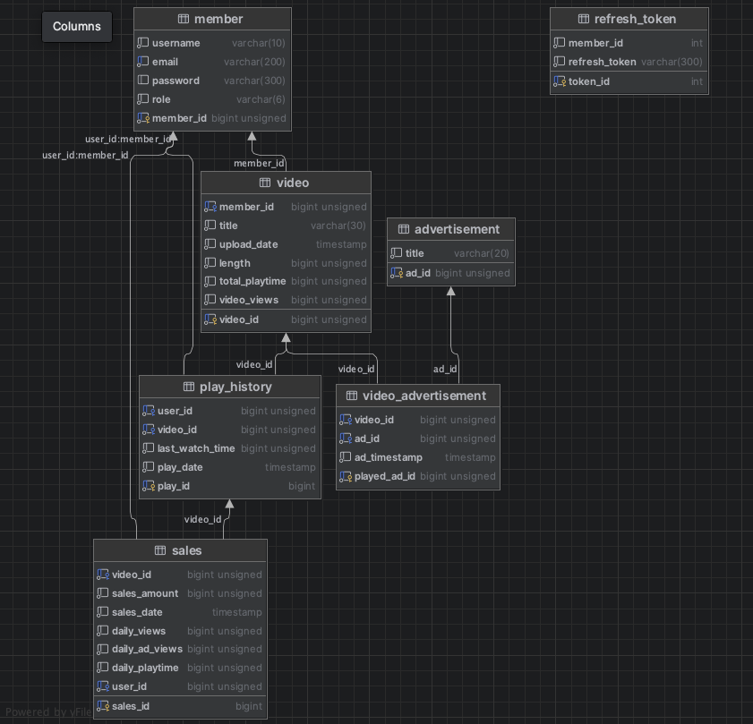

# The Shorts

### 프로젝트 개요

  

#### 영상 스트리밍 서비스 정산 시스템
개인 프로젝트로 진행한 스프링 기반 프로젝트입니다.
영상 스트리밍 서비스에서 중요한 부분 중 하나는 사용자들의 시청 기록을 정확하게 추적하고 이를 기반으로 통계 및 정산을 수행하는 것입니다.
이 프로젝트에서는 스프링 프레임워크의 스케줄러를 활용하여 대용량의 시청 기록 데이터를 분산 처리하고, 정기적으로 통계 및 정산 작업을 수행하는 시스템을 개발하였습니다.

- 스케줄러를 활용하여 대량의 동영상 시청 기록 데이터에 대한 통계 및 정산 시스템 개발

- 영상 시청 및 통계/정산을 멀티 모듈로 분리

📚 <a href="https://baegopa.notion.site/b2dc3bb1267e419ba5626466b6fff957?pvs=4">프로젝트 상세 문서</a>

---
### 프로젝트 주요 기능
- #### 동영상
  - 등록된 동영상 재생
    - 재생 시 기존에 조회했던 영상의 경우 최근 재생 시점부터 재생
    - 최초 조회의 경우 처음부터 조회
    - 재생 시 해당 영상의 조회수 증가
    - 중단 시 현재까지 재생한 시점 저장
  - 등록된 동영상에는 각각 1개 이상의 광고영상 등록
    - 광고 영상이 등록된 시점까지 영상이 재생 된 경우 광고영상의 시청 횟수 카운트
  - 현재 재생 가능한 동영상 DB 관리
    - 영상 업로드
    - 영상 삭제
    - 영상 수정
- #### 통계 및 정산
  - 영상 통계
    - 1일, 1주일, 1달 동안 조회수가 높은 동영상 TOP5 조회
    - 1일, 1주일, 1달 동안 재생 시간이 긴 동영상 TOP5 조회
  - 동영상 별 정산 금액 계산
    - 업로드 영상 정산 금액 계산
    - 광고 영상 정산 금액 계산
  - 정산 데이터 조회 기능 개발
    - 1일, 1주일, 1달 동안 총 정산금액, 영상별 정산금액, 광고별 정산금액을 영상별로 조회
- #### 사용자
  - jwt 토큰을 활용한 로그인 기능
  - 소셜 로그인을 통한 회원 가입 기능
  - 사용자 계정과 판매자 계정의 권한 구분

---
### 트러블 슈팅
#### 1. 영상 누적 조회수와 재생 기록 수의 합산이 다른 문제
  - 기존
    - 이전 재생 기록을 불러온 후 stop할 경우, 기존 기록을 업데이트 하며 전체 조회수 차이 발생
  - 개선 방안
    - 재생기록을 불러온 뒤 stop할 때 업데이트 하지 않고 이전 데이터는 그대로 두면서 데이터 생성

#### 2. 영상 삭제 시 삭제한 영상 재생 기록이 남는 문제
  - 기존
    - 각 영상 리소스에 대해 삭제 또는 수정할 경우 테이블 간의 관계가 명확하지 않아 영상 기록 및 광고 재생 기록에 대한 더미 데이터 발생
  - 개선방안
    - Foreign Key 값 설정 시 CASCADE로 묶어 엔티티 간 서로 연결되도록 재구성

---
### ERD 다이어그램

---
### 적용 기술

- #### Spring Security
  - 사용자 / 판매자 계정 권한에 따른 서비스 이용 제한
- #### Scheduler
  - 통계 및 정산 데이터 생성
- #### OAuth2
  - 구글 소셜 회원가입 및 로그인
- #### JWT Token
  - 로그인 상태 유지를 위한 토큰 발급

---
### API 명세

- Video API

|           URL           | Method |Description| TEST |
|:-----------------------:|:------:|:----:|:----:|
|       /api/videos       |  GET   |모든 영상 정보 반환|  ✅   |
|       /api/videos       |  POST  |영상 업로드|  ✅   |
|    /api/videos/{id}     |  GET   |해당 영상 정보 반환|   ✅   |
|  /api/videos/play/{id}  |  POST  |해당 영상 재생|  ✅   |
|  /api/videos/stop/{id}  |  POST  |재생 중인 영상 중지|  ✅   |
|    /api/videos/{id}     | DELETE |해당 영상 삭제|  ✅   |
|    /api/videos/{id}     |  PUT   |해당 영상 수정|  ✅   |

- User API

|           URL           | Method |             Description             | TEST |
|:-----------------------:|:------:|:-----------------------------------:|:---:|
|         /login          |  GET   |          사용자 로그인 페이지 반환             |  ✅  |
|         /signup         |  GET   |           사용자 회원가입 페이지 반환           |  ✅  |
|          /user          |  POST  |              사용자 회원가입               |  ✅  |
|         /logout         |  GET   |              사용자 로그아웃               |     |

- Statistics API

|                         URL                          | Method |Description| TEST |
|:----------------------------------------------------:|:------:|:---------:|:----:|
|                   /api/stats/{id}                    |  GET   |     해당 영상 날짜별 통계 정보 반환      |  ✅   |
|                   /api/daily/views                   |  GET   |  일간 조회수 TOP5 영상 정보 반환   |  ✅   |
|                 /api/daily/playtime                  |  GET   |일간 재생 시간 TOP5 영상 정보 반환|  ✅   |
|                  /api/weekly/views                   |  GET   | 주간 조회수 TOP5 영상 정보 반환  |  ✅   |
|                 /api/weekly/playtime                 |  GET   |주간 재생 시간 TOP5 영상 정보 반환|   ✅  |
|                  /api/monthly/views                  |  GET   |월간 조회수 TOP5 영상 정보 반환|  ✅   |
|                /api/monthly/playtime                 |  GET   |월간 재생 시간 TOP5 영상 정보 반환|  ✅   |
|                   /api/stats/force                   |  POST  |일간 통계 데이터 강제 생성|  ✅   |

---
### 프로젝트 구성
개발 기간 : <n>2024. 04. 20 - 2024. 05. 14</n>

|                         최동주                          |
|:----------------------------------------------------:|
|                          BE                          |
| [@baegopa-always](https://github.com/baegopa-always) |

---
### 개발 환경
- Spring Boot 3
- Spring Security
- JPA - Hibernate / Native Query
- IntelliJ
- Gradle 17.0.11
- Mac OS 14
- MySQL 8.3.0
- Java / OpenJDK 17
- Docker / Docker Compose

---
### 참고 문서
#### 📚 <a href="https://spring.io">Official Spring Framework Docs</a>
#### 📚 <a href="https://jojoldu.tistory.com/331?category=902551">이동욱님의 Spring Batch 가이드</a>
#### 📚 <a href="https://product.kyobobook.co.kr/detail/S000201766024">스프링 부트 3 백엔드 개발자 되기: 자바 편</a>
#### 📚 <a href="https://seosh817.tistory.com/387">[Docker] 도커 컴포즈(Docker compose) - 개념 정리 및 사용법</a>

